# 科学上网SSR  windows  安卓
[TOC]

## 1.windows

### 1.1 准备材料

[ShadowsocksR-win-4.9.2](./software/ShadowsocksR-win-4.9.2.7z)（主要）

[SwitchyOmega_Chromium.crx](./software/SwitchyOmega_Chromium.crx)（谷歌插件，我用的浏览器可以使用谷歌插件，叫百分浏览器）

下载不了就用蓝奏云链接: <https://lanzous.com/ic46ajg>

### 1.2 软件操作

#### ShadowsocksR-win-4.9.2

**解压**下载的ShadowsocksR-win-4.9.2.7z，点击图中红色圈圈**打开软件**

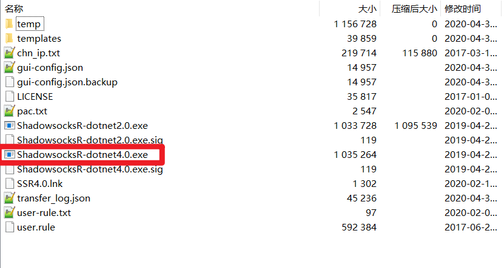

怎么**添加节点**和**服务器订阅**自行搜索了解！
suying666.net 这个机场不错，不过需要科学上网。

------

#### SwitchyOmega_Chromium.crx

谷歌类型浏览器添加扩展程序

a.找到**扩展程序**设置
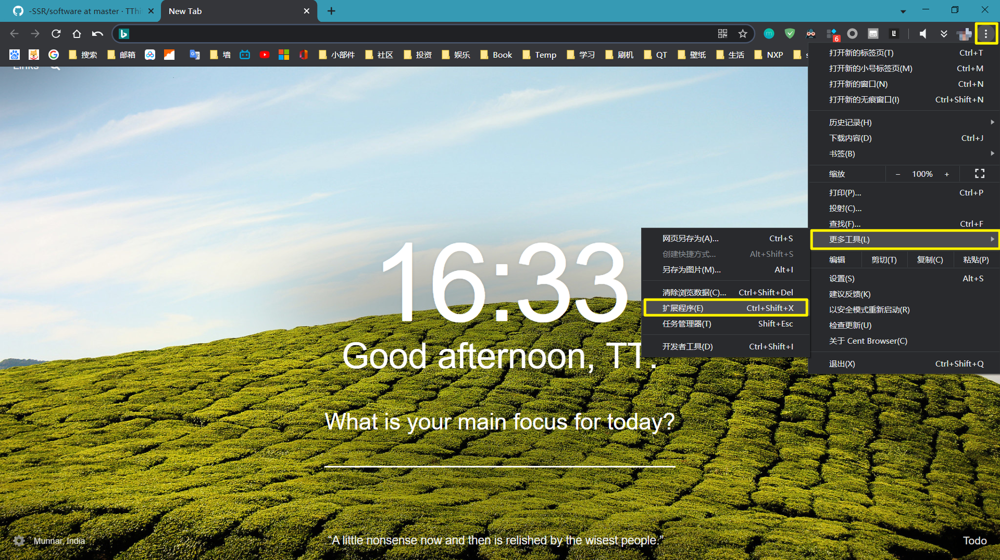

b.打开**开发者模式**
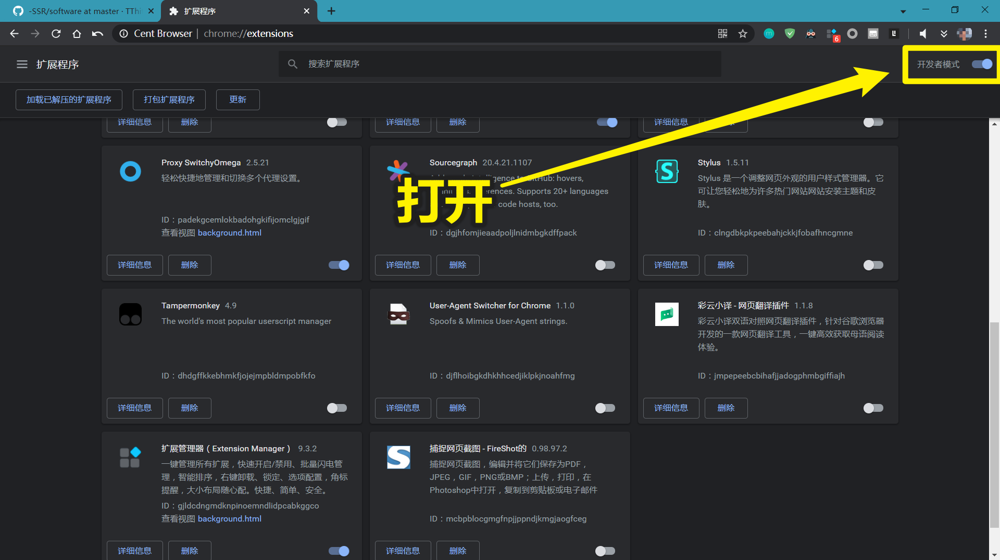

c.把.crx文件**拖到**浏览器中
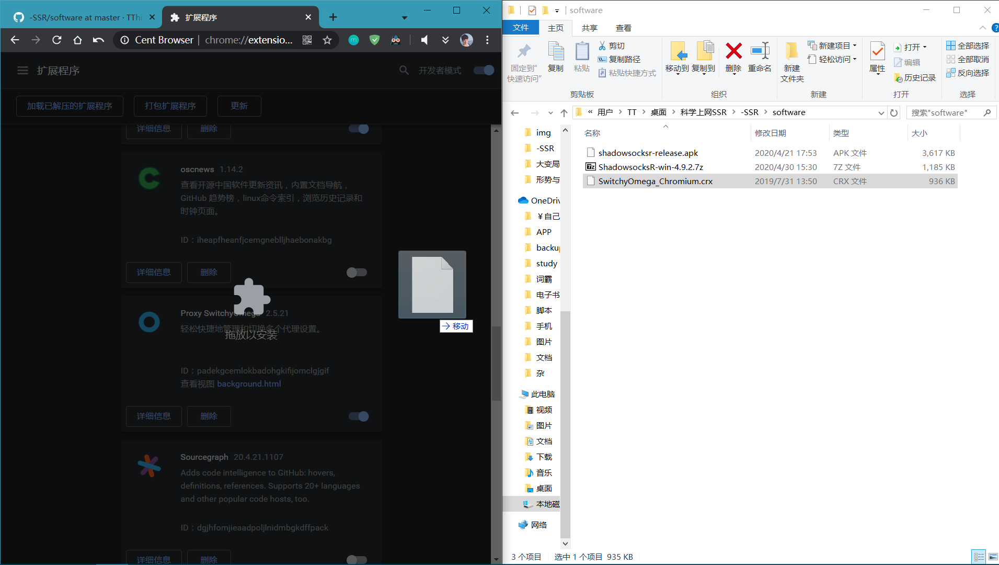

d.**右键**点击程序，打开**选项**设置
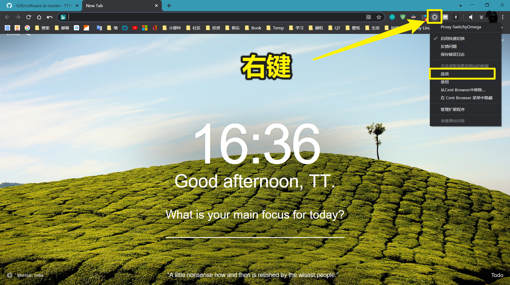

e.**新建**一个模式，名称随便写，点击创建
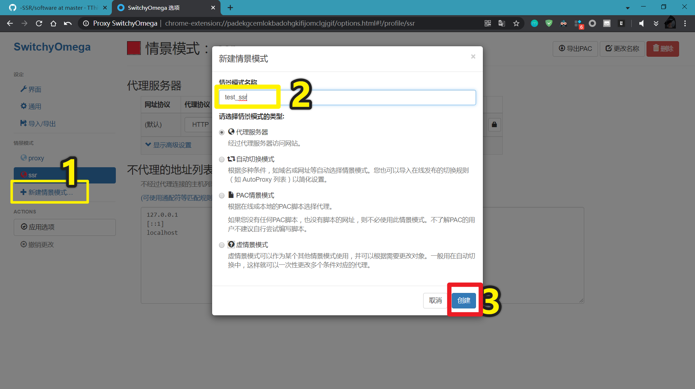

f.**按图**填写
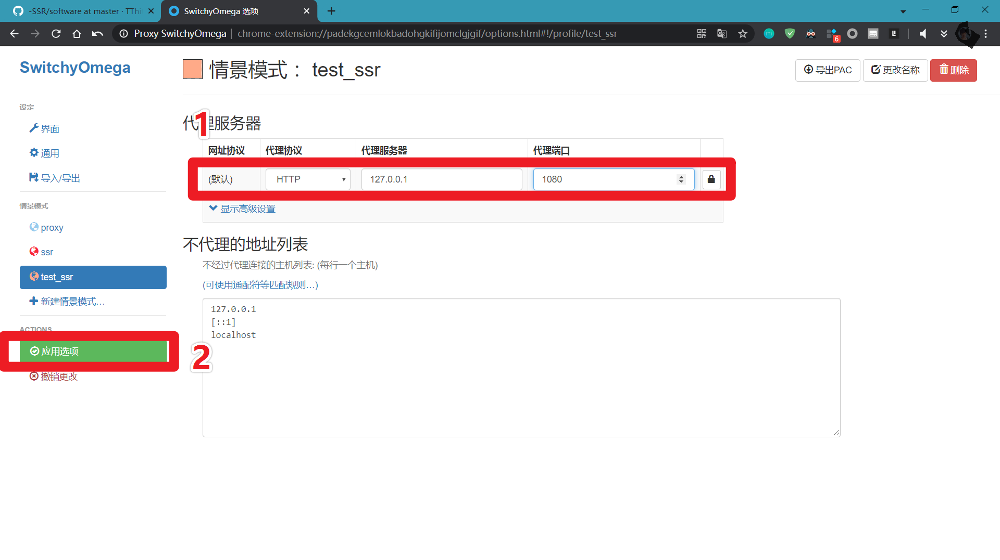

g.**点击**程序，**选中**刚刚创建的模式
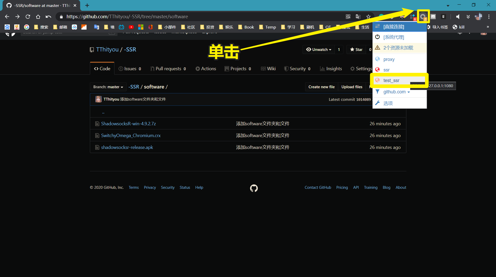

**h.完成！**

------

### 1.3 步骤与结果

完成两个软件的安装就开始我们的科学上网！

a.分别打开两个软件，SwitchyOmega选中创建的模式，打开<https://www.youtube.com/>

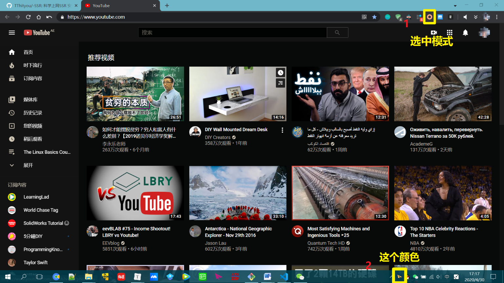

b.选择不同节点

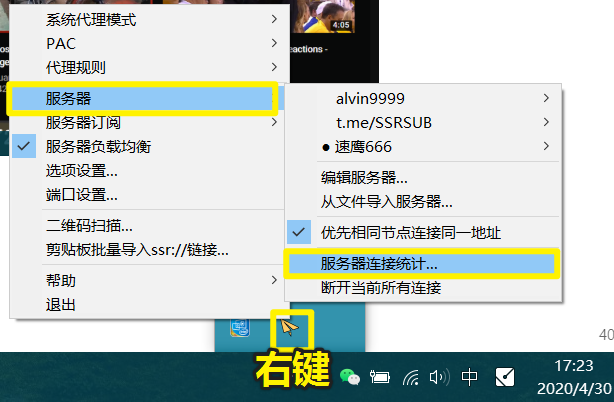

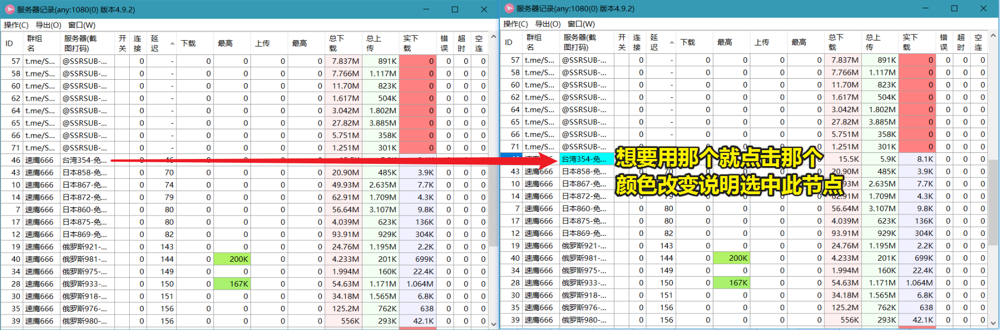

------

## 2.安卓

### 2.1 准备材料

[安卓联网手机一部](https://cn.bing.com/search?q=%E5%AE%89%E5%8D%93%E8%81%94%E7%BD%91%E6%89%8B%E6%9C%BA&amp;PC=U316&amp;FORM=CHROMN)  (自己想办法)

[shadowsocksr-release.apk](./software/shadowsocksr-release.apk)  (我提供)

apk安装包下载不了就用蓝奏云链接: <https://lanzous.com/ic46ajg>

### 2.2 软件操作和效果
由于软件禁止截屏录屏，所以采用拍照的形式，效果欠佳。

a.**打开**SSRR软件
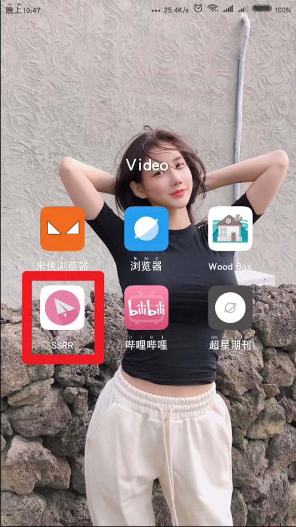

b.点击**框框**位置，选择节点
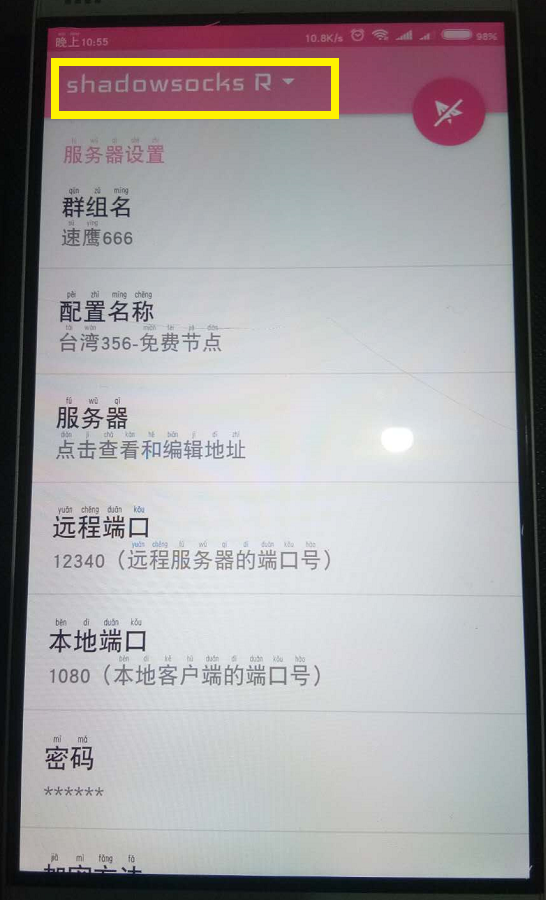

c.点击"**闪电**"图标就可以测速，查看节点是否可用
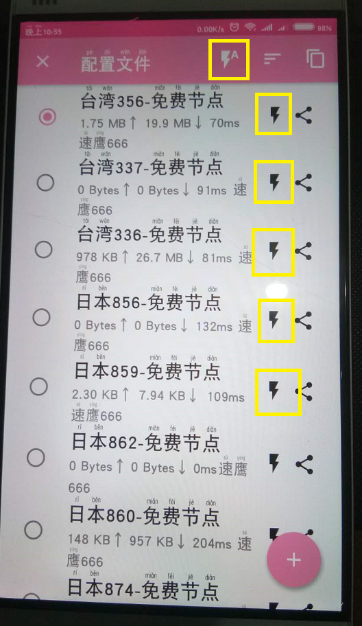

d.点击"**+**",点击"**添加/升级SSR订阅**"
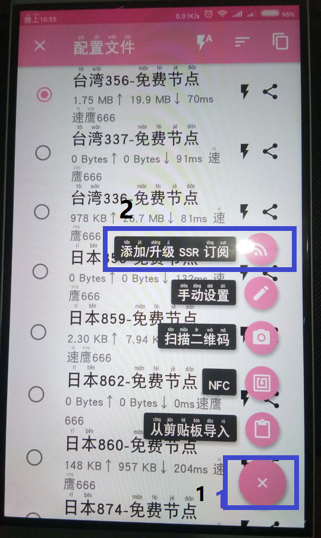

e.点击"**添加订阅地址**"
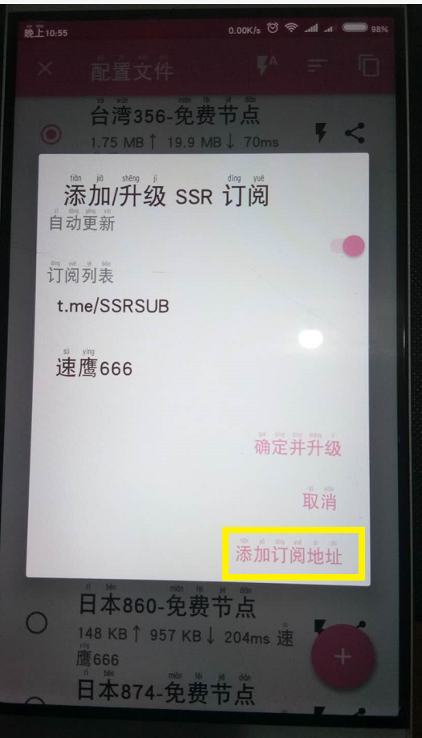

f.把**SSR地址**粘贴到输入框 (友情提供一个https://raw.githubusercontent.com/ssrsub/ssr/master/ssrsub)
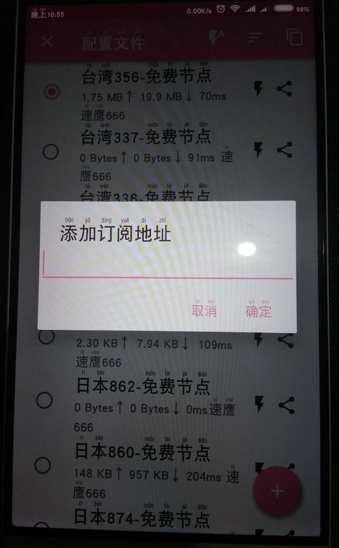

g.点击**飞机图标**连接，点击**框框**测速
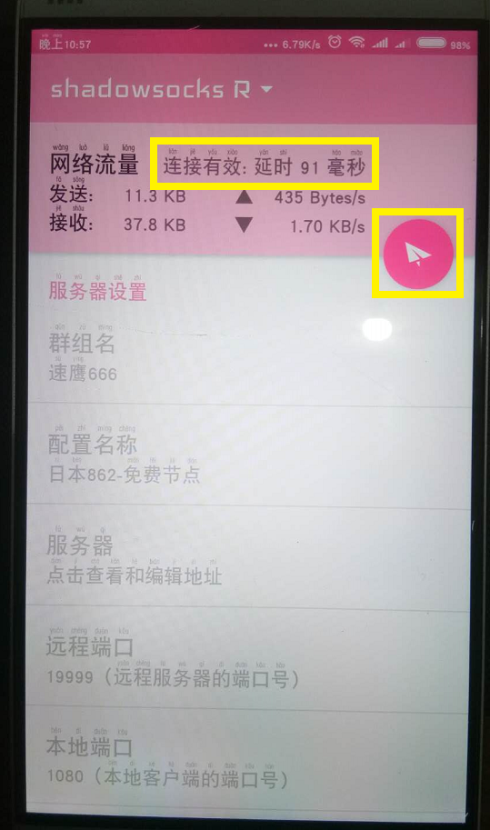

h.打开<https://www.youtube.com/>效果
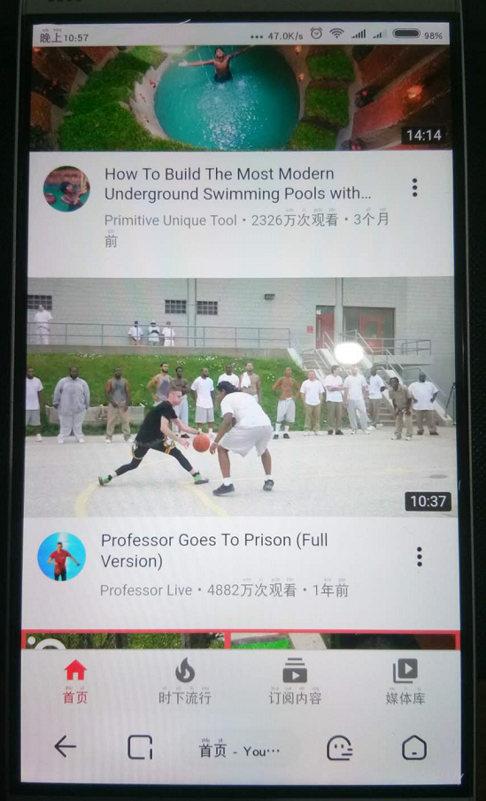

**i.完成！**

## 3.感谢

希望大家批评指正，共同进步，科学上网一定要科学，遵纪守法，热爱祖国！

本教程(项目)不承担在本教程(项目)使用过程中产生的任何法律和道德责任。

客服QQ：1289028249(备注：TThityou-SSR)